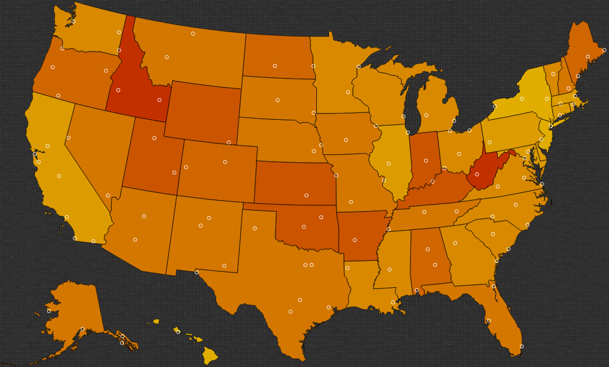
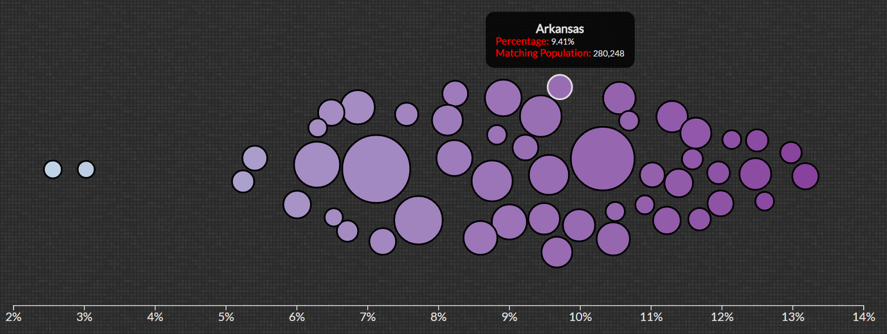

# Demographic Analysis

This was a group project at the University of Utah. In this project, we visualize
different demographics from the united states and portray them in various ways.
This can be helpful for focused advertising in marketing and in understanding
cultural differences between different areas.

This is the first plot which shows a geographic representation of the US with
a color scheme indicating the percentage of the population that match the
selected attributes.

By clicking on a state, it will zoom in and show the counties of that state,
where the counties will be colored based on if any info was provided by the
census bureau. Since this is the American Community Standards (ACS) survey,
which is done every year, not every county is provided, though the census
bureau is able to extrapolate the state as a whole within a few percentage points
of accuracy.

The white circles are cities, where by hovering over a circle will give you
the city name.

This is the second plot which shows each state represented as a bubble. Their
position on the x axis is based on the percentage of the population in that
state that matches those attributes. The size of the circle is relative to the
number of people in that state that match the attributes. This was achieved
by taking the matching percentage and multiplying by the total population.

*Note*: The position on the x axis is relative and not exact. They are usually
pretty close, however if there are many states around that percentage, it can
throw off some of the smaller circles.

## Hosting

This project is hosted [here](https://mrabaris.github.io/DemographicAnalysis/).
